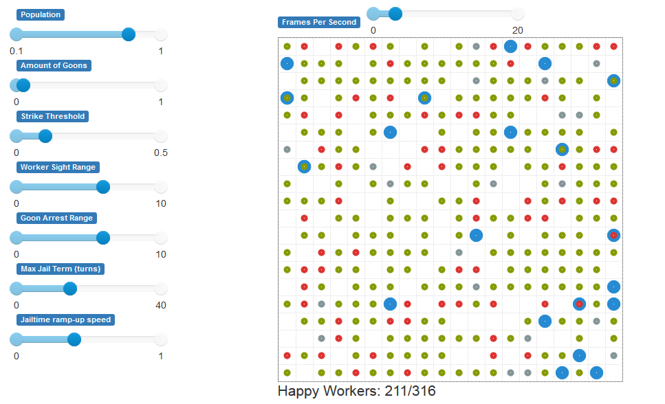
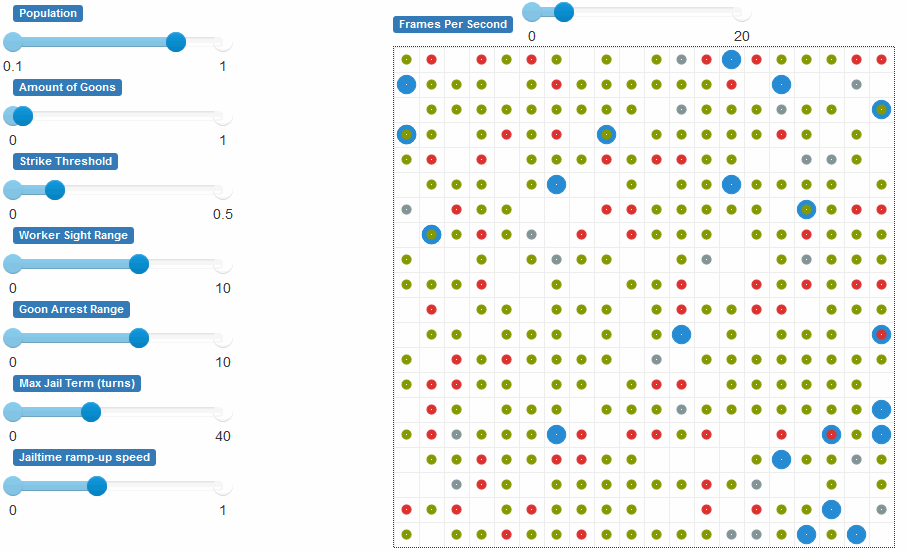
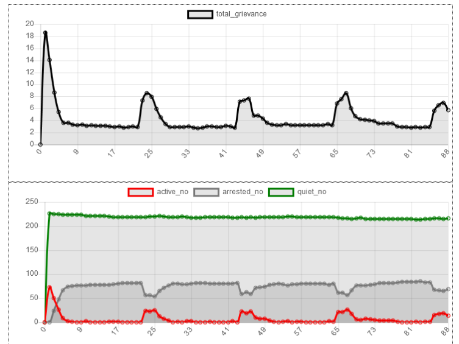

# worker-riot-model
A simple agent based model for worker rioting patterns based off perceived wage inequality and in-group effects

This model comes with its own web server, so the model can be played with in-browser with parameter sliders and real-time graphing and metric capabilities.

|Static demo|Animated demo of riot being quelled|
|---|---
||

The model is a refinement and improvement on the Epstein Model of civil unrest[1], and includes the effect of both real and perceived pay inequality into its calculations and incorporates the notion of more severe punishments for repeat offences.

# How it works
The workers are represented as the small dots, and can either be happy (green), rioting (red) or suppressed (grey). The "goons" or company enforcers/police are represented as the larger blue dots, and roam around suppressing any rioting workers they see.

Workers are each given a normally-distributed wage and "risk tolerance". Each tick, every worker looks around at its nearby fellows, and decides whether or not to riot based on its wage compared to the local average, the number of goons nearby, the number of rioting workers nearby, and its risk-tolerance trait.

After being suppressed, workers become inactive for a certain number of turns, which ramps up according to a sigmoid function after every successive arrest.

In the future I plan to add the possibility of internal social groups amongst workers forming, so that workers are no longer entirely selfish when it comes to some of their brethren, but equally they ignore the struggles of the "outgroup" on occaision too.

# Conclusions

Even with the model as it is now, however, two interesting effects can be seen.

Observed are long periods of peacefulness (longer than the maximm jail term, note) interspersed with brief explosions of violence, which are known as a "punctuated equilibrium" and have long been an observed effect in real-world social unrest situations.

Another real-world effect seen here also is one known as "deceptive behaviour", when aggrieved workers pretend to be quiet in the presence of goons/law enforcement, but riot when left unattended.

------------
[1]: 
Epstein, J. (2002). Modeling civil violence: An agent-based computational approach. Proceedings of the National Academy of Sciences of the United States of America, 99(SUPPL. 3), 7243-7250. https://doi.org/10.1073/pnas.092080199
